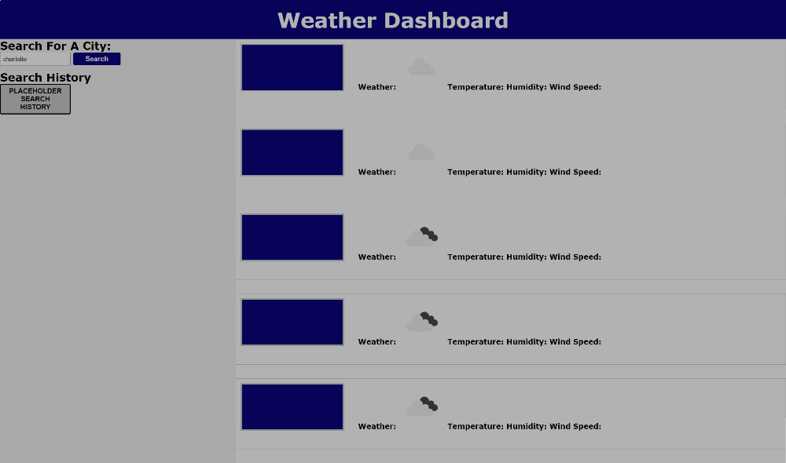

# Weather-Dashboard

## Description

Motivation
- To assist travelers in efficiently planning their trips by providing weather outlooks for multiple cities, aiding in making informed travel decisions.

Purpose
- The weather dashboard aims to offer users the ability to input cities, retrieve current and future weather conditions, and store search history, empowering travelers to plan their trips based on comprehensive weather data.

Problems
- Handling the integration of multiple API calls for current and future weather data, and managing the dynamic presentation of weather information on the dashboard.

Learnings
- Developers will gain experience in efficiently handling API integration for weather data and implementing dynamic frontend interactions for seamless user experience.

## Screenshot

## Links
[Live URL](https://xtianhope.github.io/weather-dashboard/)